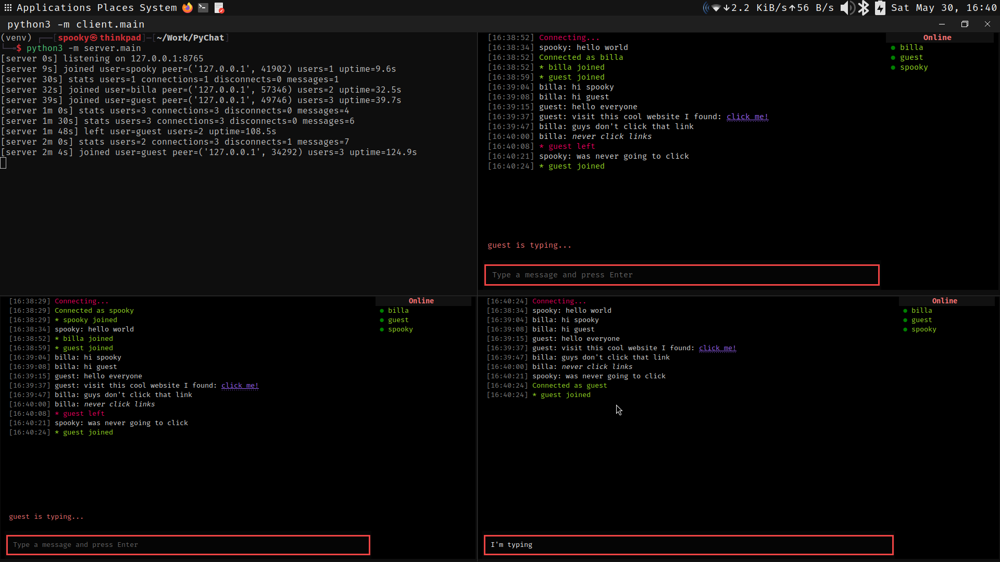

# Term-Chat

A real-time terminal chatroom app with an asyncio server and a Textual TUI client.

## Features
- Async TCP server with heartbeats and stats logging
- Textual UI with timestamps, typing indicator, and user list
- Headless client mode for quick testing
- Pydantic-validated JSON protocol with newline framing
- Message history delivered on connect
- Nickname changes and action messages

## Requirements
- Python 3.11+

Install dependencies:

```
pip install -r requirements.txt
```

## Run

Start the server:

```
python -m server.main
```

Run the client UI:

```
python -m client.main --username spooky
```

Headless mode:

```
python -m client.main --headless --username spooky
```

## Commands
- `/help` show help (headless)
- `/nick <name>` change nickname
- `/me <action>` action message
- `/quit` or `/exit` disconnect

## Screenshot



## Project layout
```
term-chat/
├── requirements.txt
├── shared/
│   ├── protocol.py
│   └── exceptions.py
├── server/
│   ├── daemon.py
│   ├── heartbeat.py
│   ├── main.py
│   └── state.py
└── client/
    ├── main.py
    ├── ui/
    │   ├── app.py
    │   └── styles.tcss
    └── network/
        └── node.py
```

## Notes
- All network packets are JSON lines terminated by `\n`.
- The server keeps a per-session user list; offline users stay visible in gray.
